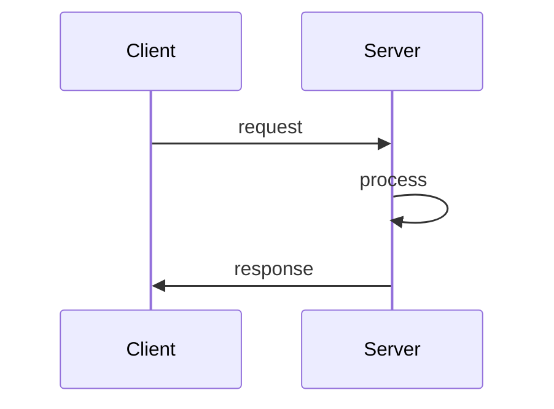
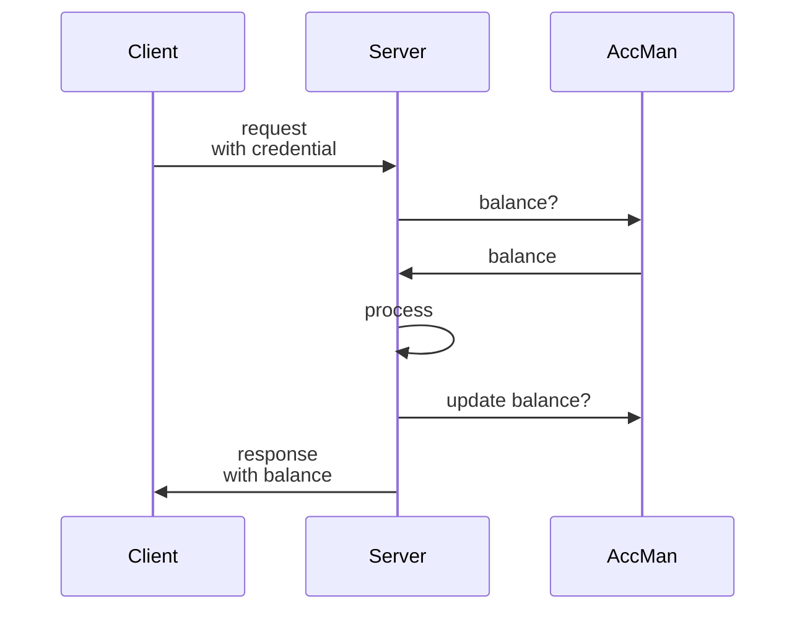

# AccMan

> A simple account manager

## Usage

This repo uses nix flakes. Dependencies include `nodejs pnpm just`. From a dev
shell or otherwise

```bash
pnpm i && pnpm start
```

There are some helper function with `just`

```sh
just mod deadbeef 100
just tot deadbeef
```

(Remember the credentials must be valid base64).

## What is AccMan?

Suppose we provide a service running through a web-api. We some servers and the
consumers of the service run clients. A usual bit of service looks like:



All was well but we've just seen are latest server bills, and its not a pretty
picture. We need to charge consumers for some of their usage, or soon we won't
be running any service at all.

Let's unpack how we could achieve this with AccMan. We'll require any service
consumer to open an "account". Opening an account requires the consumer to send
some funds (via whatever means are appropriate - this is OOB). On receipt of
funds, we generate some credentials and inform both the AccMan and the consumer
that a new account is ready.

An account has some unique credential associated with it. The consumer hands the
credentials to their client. Now each request the client sends must contain the
credential.

The service provision sequence now looks like:



Our server needs to be adapted to handle the additional logic. Namely:

1. An `onRequest` hook that finds the credential in the `ACCMAN` header and uses
   this to get the associated balance from AccMan.
2. Ability to calculate the cost of a request
3. An `onSend` hook that updates the balance on AccMan and adds the balance to
   an `ACCMAN` header in the response.

We additionally need to handle some new failure cases.

1. Account does not exist.
2. Account has insufficient balance

## AccMan api

AccMan has just two endpoints:

1. `/tot?cred=<cred>` - get tot (aka balance) of the account
2. `/mod?cred=<cred>&by=<amt>` - mod the account by amount `amt`.

For example, on a successful account open, we `mod` the account by the
appropriate amount.

```
accman.local/mod?cred=<cred>&by=1000000
```

If the account did not previously exist, it is created. To deduct funds from an
account, `mod` by a negative amount.

## Stack

The project uses the fastify framework with a leveldb database.

## Todos

- [x] basic api
- [ ] add `/past` to see account past.
- [ ] basic tests

## Notes

Why is `mod` a patch request? Because it has side effects.
